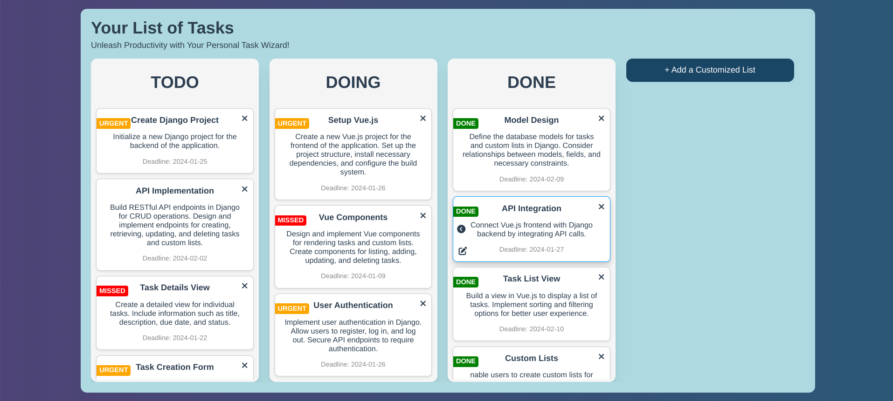

# ToDo Kanban Board

Welcome to ToDo Kanban Board! This project allows you to manage your tasks using a Kanban board, where you can organize your tasks into different lists such as To-Do, Doing, and Done. Additionally, you can customize lists, edit tasks, remove tasks, and transfer tasks between lists.

## Features

- **Kanban Board:** Organize your tasks into To-Do, Doing, and Done lists.
- **Add Tasks:** Easily add new tasks to your lists.
- **Customize Lists:** Create and customize lists based on your workflow.
- **Edit Tasks:** Update and modify the details of your existing tasks.
- **Remove Tasks:** Remove tasks that are no longer relevant or completed.
- **Transfer Tasks:** Move tasks between lists to reflect their current status.

## Task Status Indicators

Tasks in the Kanban Board come with additional status indicators to provide more context:

- **Missed:** If the task is already due, it will be marked as "missed."
- **Urgent:** If the task is due in 3 days or less, it will be marked as "urgent."
- **Done:** Once a task is completed, it will be marked as "done."

## Screenshots

Include screenshots or GIFs showcasing the user interface and functionality of your ToDo project.

